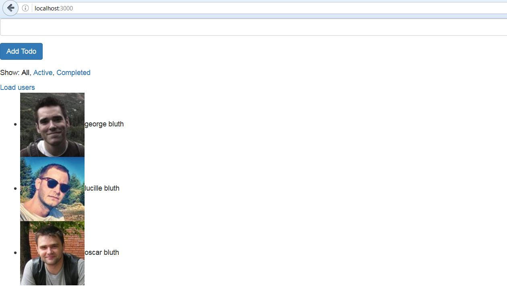

# ReduxTodoList
A react-redux todo list sample application, using react-router for front-end state management.

This sample project contains one **Async action** as well to fetch some fake user data from a restful api endpoint `http://reqres.in/api/users?page=1`.

## Run

`npm start`

Then goto `http://localhost:3000/`  (App deployed on Webpack dev server)

 - Insert Todos using the form avaiable.
 - Play with the filters to change their visibility.
 - Click on `Load users` link to call the async action of fetch data using ajax call.

## Output
 

